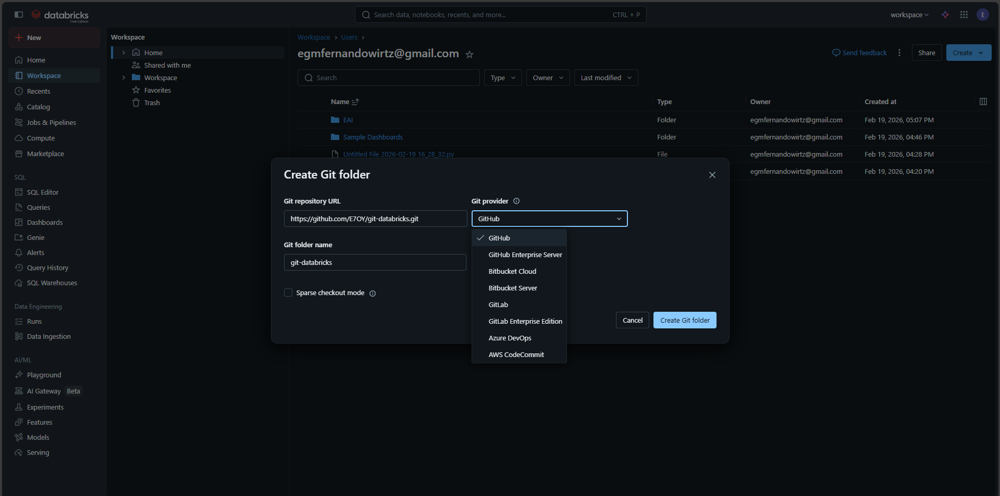
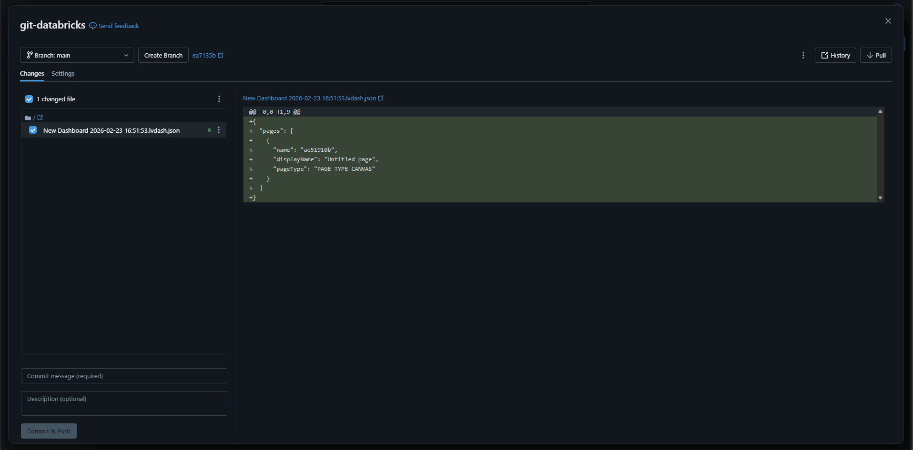

# git-databricks

## operaciones con git y databricks

### Clonar un repo
* Desde el workspace de Databricks -> Create -> Git Floder
* Rellenamos con los datos de nuestro repo como en la imagen siguiente: 

* Click en "Create Git Folder"

### Pull al repo remoto
* Una vez clonado el repo, si le damos a los tres puntos de la carpeta -> Git, se nos abre el diálogo para realizar operaciones Git:

* Desde este diálogo podremos hacer pull de los cambios del repo remoto, hacer un Commit & Push al repo remoto e incluso crear una nueva rama dentro del repo.

### Automatizar pull requests